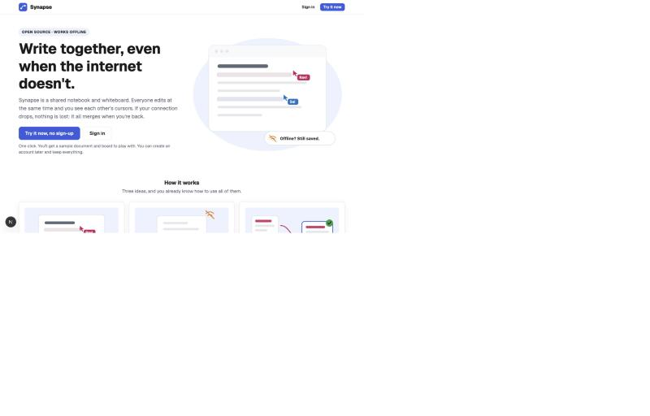
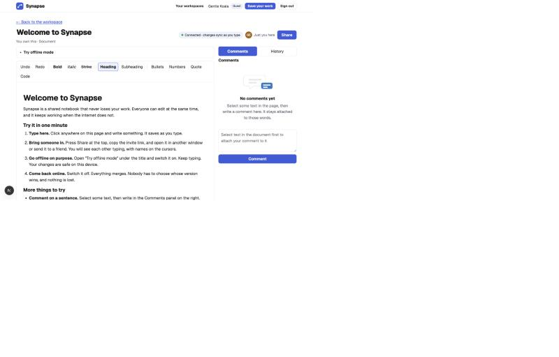
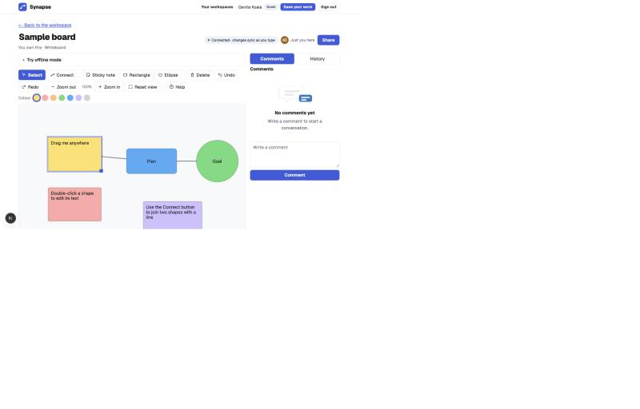
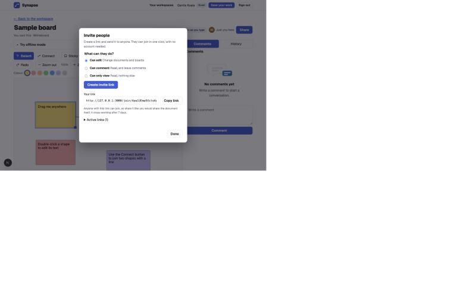
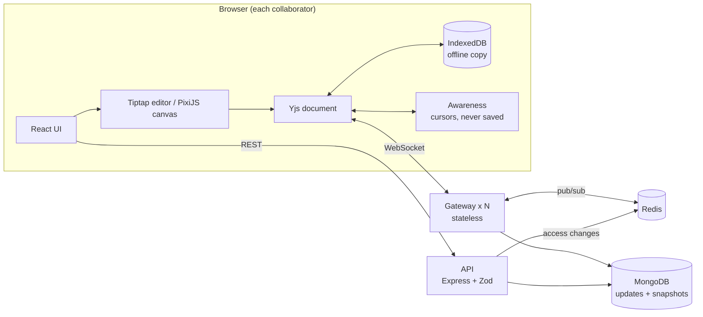

# Synapse

A local-first collaborative workspace: rich-text documents and a shared canvas
that keep working offline and merge cleanly when you reconnect.



## Try it in one minute

You need Node 22+, MongoDB and Redis installed (`brew install redis` and
`brew tap mongodb/brew && brew install mongodb-community` on a Mac). Then:

```bash
./dev.sh
```

Open <http://localhost:3000> and press **Try it now**. No sign-up: you get a guest account, a
Welcome document that teaches the app, and a sample whiteboard. Press **Share**, copy the invite
link and open it in a second window to see two people editing live. Switch on **Try offline mode**,
type in both windows, switch it off, and watch everything merge.

| Document and toolbar | Whiteboard | Invite people with a link |
|---|---|---|
|  |  |  |

Guest accounts are temporary; **Save your work** turns one into a real account. On a public server
you can turn guests off with `GUESTS_ENABLED=false` and clear old ones with
`cd server && npm run prune-guests -- --days 30` (add `--delete` to really remove them).

> **Read first:** [Why Synapse uses a CRDT and not OT](docs/blog/why-a-crdt-not-ot.md), the blog post behind the central design decision.

> **Status.** The core product works and is tested, with real MongoDB and Redis.
> It is a portfolio project that has only run on one development laptop, not a
> deployed service. See [what is not built](#what-is-not-built-or-not-proven) before
> trusting any claim here.

## Architecture



### How an edit travels

1. You type. Tiptap turns the keystroke into a small Yjs update, and the screen paints before any network call.
2. `y-indexeddb` stores the update in the browser, so it survives a refresh or a dead connection.
3. The update goes over the WebSocket to the gateway holding your connection.
4. The gateway checks your role (viewers cannot write), applies the update to the room, and publishes it on Redis.
5. Every other gateway with that room open forwards it to its clients, where Yjs merges it deterministically.
6. The updates are appended to a log in MongoDB and periodically compacted into a snapshot.

### Two consistency domains (the central design decision)

| Document content | Access control |
|---|---|
| Eventually consistent | Server-authoritative |
| Merged automatically by Yjs, editable offline | Checked on room join and on **every** write |
| Temporary differences between copies are fine | Never stored inside the shared document |
| | Revoking access takes effect immediately |

See [ADR 0002](docs/adr/0002-two-consistency-domains.md).

## Features

- **Block editor** (Tiptap): headings, lists, quotes, code, per-user undo.
- **Canvas** (PixiJS/WebGL): rectangles, ellipses, sticky notes, connectors, pan and zoom, resize, per-user undo, live cursors, keyboard access for every action.
- **Live cursors and presence**, with joins announced to screen readers.
- **Offline editing** with merge on reconnect; reconnect uses exponential backoff with jitter.
- **Comments** anchored to text with Yjs relative positions, so they keep their place while others type.
- **Version history**: named versions, preview, restore (current content is saved first).
- **Sharing and roles**: owner, editor, commenter, viewer, enforced by the server. Removing someone closes their open connection within about two seconds and clears their offline copy.
- **Search** across your workspaces (MongoDB text index).
- **Network simulator**: simulate offline or add 200 ms to 3 s of delay in one click.
- **Observability**: one Grafana dashboard for sync latency, typing latency, reconnects, sockets, database writes, the Redis relay and the API, with 10 alert rules; verified by breaking Redis and MongoDB while watching it. See [`docs/OBSERVABILITY.md`](docs/OBSERVABILITY.md).
- **Accessibility**: WCAG 2.2 AA as the target, audited with axe in light and dark themes and with real keyboard testing; see [`docs/ACCESSIBILITY.md`](docs/ACCESSIBILITY.md) (**no screen reader was run**).

## Tech stack, and why

| Layer | Choice | Reason |
|---|---|---|
| App | Next.js 16, React 19, TypeScript | App shell and routing |
| Editor | Tiptap 3 (ProseMirror) + `y-tiptap` | Mature rich text with a first-class Yjs binding |
| Canvas | PixiJS 8 (WebGL) | Fast rendering of hundreds of shapes |
| CRDT | Yjs | Proven shared types, compact binary updates ([ADR 0001](docs/adr/0001-crdt-yjs-over-ot.md)) |
| Offline | `y-indexeddb` | Stores updates in the browser |
| Realtime | Node + `ws` + `y-protocols`, written by hand | The sync protocol is the learning ([ADR 0003](docs/adr/0003-custom-ws-gateway.md)) |
| Fan-out | Redis pub/sub | Any gateway can serve any room ([ADR 0006](docs/adr/0006-stateless-gateways-redis.md)) |
| API | Express 5 + Zod | Every request body validated |
| Database | MongoDB | Binary updates keyed by document ([ADR 0005](docs/adr/0005-mongodb-storage.md)) |
| Auth | scrypt passwords, signed JWTs (`jose`) | ([ADR 0007](docs/adr/0007-authentication.md)) |
| Metrics | OpenTelemetry (metrics) + Prometheus + Grafana | Latency, reconnects and server health on one dashboard ([ADR 0011](docs/adr/0011-observability.md)) |
| Tests | Vitest + fast-check, `supertest` | Property-based convergence, real-database tests |

Architecture decision records are in [`docs/adr/`](docs/adr/) (eleven of them, including failure handling and observability).

## Run it

You need Node 22+, MongoDB and Redis. On macOS with Homebrew:

```bash
brew install redis
brew tap mongodb/brew && brew trust mongodb/brew && brew install mongodb-community
```

Start the data stores (data stays in `.infra/`; nothing runs at login):

```bash
mkdir -p .infra/redis .infra/mongo
redis-server --port 6379 --dir .infra/redis --save "" --appendonly no &
mongod --dbpath .infra/mongo --port 27017 --bind_ip 127.0.0.1 &
```

Start the server (gateway on :4000, API on :4001) and the web app (:3000):

```bash
cd server && npm install && npm run dev
cd web    && npm install && npm run dev
```

Optional: the monitoring dashboard (needs `brew install prometheus grafana` once):

```bash
observability/start.sh        # Prometheus :9090, Grafana :3030 (dashboard "Synapse"; stop with observability/stop.sh)
```

Open <http://localhost:3000/login> and create an account. To be signed in as
two people at once, use `localhost:3000` for one and `127.0.0.1:3000` for the
other: each address keeps its own login. (Accounts live only in your local
MongoDB; the demo scripts in `server/bench/` take an account from the
`DEMO_EMAIL` and `DEMO_PASSWORD` environment variables.)

Environment variables (all optional in development): `MONGO_URL`, `MONGO_DB`,
`REDIS_URL` (set by `npm run dev`), `JWT_SECRET` (**required** when
`NODE_ENV=production`; 32+ characters), `GATEWAY_PORT`, `API_PORT`,
`WEB_ORIGIN`, `SERVICE=gateway|api|both`, `METRICS_PORT` (default 9464, `0` turns metrics off).

## Tests and benchmarks

```bash
cd server && npm test        # 58 tests: sync, roles, revocation, storage, concurrent compaction, self-healing, metrics
cd web    && npm test        # 100 tests: canvas data model, colour contrast, keyboard and ARIA behaviour, sync-client metrics
cd web    && npm run lint    # ESLint with Next.js and React 19 rules
cd web    && npm run typecheck  # generates Next.js types, then runs tsc
cd server && npm run bench:load   # also: bench:propagation, bench:partition, bench:convergence
```

The server tests run against real MongoDB and Redis, so start them first.

**Fault injection** (`cd server && npm run test:fault`, about 90 seconds) breaks Redis,
MongoDB, gateways and the WebSocket input while people are editing, using private
copies of the databases so your own data is untouched. It found a crash from
malformed input, edits lost during a database outage, and a relay that never
repaired itself after a long Redis outage; all fixed and re-tested. Results,
including what was NOT tested: [`docs/FAULT-INJECTION.md`](docs/FAULT-INJECTION.md).

Headline results (one laptop, loopback network, so these show the server's own
cost, not real-world latency; method and limits in [`docs/BENCHMARKS.md`](docs/BENCHMARKS.md)):

| Measure | Target | Result |
|---|---|---|
| Remote update propagation, p95 | < 250 ms | 0.8 ms (1.3 ms across two gateways) |
| Convergence after a long partition | < 2 s | 13 to 58 ms |
| Randomized convergence | 100% | 10,000 of 10,000 runs |
| Editors in one room | 50+ | 200, no lost messages, p95 6.5 ms |
| Keystroke-to-paint, p95 | < 50 ms | 16.6 to 17.4 ms |
| Canvas with 500+ objects | 60 FPS | about 120 FPS (120 Hz display) |

## Repository layout

```
server/src    gateway (room.ts, gateway.ts), storage (store.ts, mongoStore.ts),
              message bus (bus.ts, redisBus.ts), API (api.ts), auth (auth.ts, access.ts)
server/test   integration and property tests
server/fault  fault-injection tests (private Redis and MongoDB, killed on purpose)
server/bench  benchmark scripts; results in bench/results/
web/src       app pages, editor, canvas (canvasModel.ts, canvasRenderer.ts),
              sync client (lib/provider.ts)
docs          blog post, benchmarks, fault-injection, accessibility and observability reports, architecture decision records
observability Prometheus config, alert rules, Grafana provisioning and the generated dashboard
lab           Yjs experiments you can run: two documents merging in a terminal, and the demos behind the blog post
STUDY.md      suggested reading order for the code
```

## What is not built, or not proven

Honest list, so nothing here is oversold.

**From the original plan, not built:**
- File and image uploads (S3 or R2 with pre-signed URLs).
- Atlas Search. Search uses a plain MongoDB text index; ranking is weaker.
- OpenTelemetry **traces** and logs (only metrics exist), the browser OpenTelemetry SDK (browsers use a small beacon instead), an Alertmanager (alert rules exist but notify no one) and an external uptime probe. The browser-reported availability measure cannot see a total outage ([`docs/OBSERVABILITY.md`](docs/OBSERVABILITY.md)).
- Playwright multi-browser end-to-end tests and k6 load tests. Browser behaviour was checked by hand and the load test is a Node script.
- TanStack Query and Zustand. Plain `fetch` and React state were enough, so they were left out.
- The "summarize this board" AI action (an optional extra).

**Built, but known limits:**
- **Not deployed**, so there is no real availability data. Nothing measured here includes real network latency.
- **Accessibility is tested, but not with a screen reader.** axe reports 0 violations on every page in both themes, and keyboard flows were driven with real key presses, but **VoiceOver, NVDA and JAWS were not run**, forced-colours mode and Safari/Firefox were not tried, and the canvas drawing itself is pixels (the object list is its accessible equivalent, limited to the first 200 objects). Details and fixes: [`docs/ACCESSIBILITY.md`](docs/ACCESSIBILITY.md).
- **Each edit is one database write.** Simple and durable, but it is the first thing to batch at much higher load.
- **Redis pub/sub is fire-and-forget.** Rooms now repair themselves by re-reading MongoDB when Redis reconnects and every 60 seconds, but a silent loss with no disconnect can still take up to a minute to heal ([ADR 0010](docs/adr/0010-failure-handling.md)).
- **Fault coverage is partial.** Tested: Redis and MongoDB dying and returning, gateway crashes, malformed input, start-up with a dead dependency. Not tested: slow dependencies, half-open connections, reconnect storms, two faults at once.
- **During a database outage, people already connected keep their last known role**, so a removal made during the outage takes effect when the database returns. New joins are refused.
- **Whole documents live in gateway memory** while a room is open, so very large documents cost RAM on every gateway holding them.
- **Auth is basic.** Invites work only for users who already have an account; there is no email verification or password reset; the login token lives in `localStorage`, and the WebSocket token travels in the URL ([ADR 0007](docs/adr/0007-authentication.md)). The login rate limiter is in memory, per API instance.
- **Lint covers the web app only.** `cd web && npm run lint` is clean (0 errors, 0 warnings). The server has types and tests but no ESLint configuration yet.
- **CI exists but has never run on GitHub.** `.github/workflows/ci.yml` runs the web checks, the server tests against real MongoDB and Redis, and a monitoring-config check. It passes `actionlint`, and I ran every step from a fresh clone locally (which found and fixed one real failure), but GitHub Actions itself was not executed, it targets Node 26 only, and the fault-injection tests are not in CI (they need `redis-server` and `mongod` installed; run them with `npm run test:fault`).
- There is **no license file** and **no remote**: the repository is local, with two commits. Choose a license before publishing.

## Interview questions this prepares for

Design Google Docs; CRDT or OT; add offline support to an existing web app;
scale WebSockets past one server; what breaks first at 10x users. Short answers
with the reasoning are in the ADRs, and the numbers are in the benchmarks.
