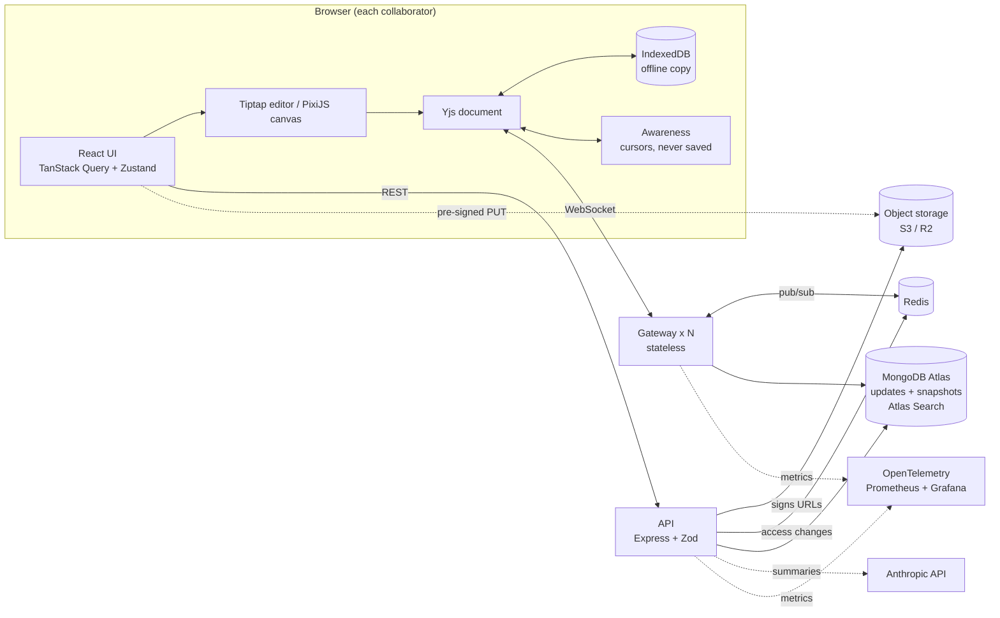

# Synapse

A local-first collaborative workspace: rich-text documents and a shared canvas
that keep working offline and merge cleanly when you reconnect.

Built by [Yashwanth Varma](https://github.com/yashwanthvarma74-ai). Live demo: <https://synapse-app-beta.vercel.app> (the server sleeps when idle on the free tier, so the first load can take up to a minute).


## Try it in one minute

You need Node 22+, MongoDB and Redis installed (`brew install redis` and
`brew tap mongodb/brew && brew install mongodb-community` on a Mac). Then:

```bash
./dev.sh
```

Open <http://localhost:3000> and press **Try it now**. No sign-up: you land in your own workspace, which already holds
a Welcome document that teaches the app and a sample whiteboard, and you choose which to open. Press **Share**, copy the invite
link and open it in a second window to see two people editing live. Switch on **Try offline mode**,
type in both windows, switch it off, and watch everything merge.

Prefer containers? `cp .env.example .env`, set `JWT_SECRET`, then `docker compose up --build`
(MongoDB, Redis, MinIO, two gateways behind a load balancer, the API and the web app; **not yet run**,
see [`docs/DEPLOY.md`](docs/DEPLOY.md)). To put it on the internet with MongoDB Atlas, see the same guide.

| Document and toolbar | Whiteboard | Invite people with a link |
|---|---|---|
|  |  |  |

Guest accounts are temporary (a month); **Save your work** turns one into a real account. On a public server
you can turn guests off with `GUESTS_ENABLED=false` and clear old ones with
`cd server && npm run prune-guests -- --days 30` (add `--delete` to really remove them).

> **Read first:** [Why Synapse uses a CRDT and not OT](docs/blog/why-a-crdt-not-ot.md), the blog post behind the central design decision.

> **Status.** The core product works and is tested, with real MongoDB (local and Atlas), Redis, an S3-compatible
> bucket and real browsers. It is a portfolio project that has run on one development laptop, **not a deployed
> service**. See [what is not built or not proven](#what-is-not-built-or-not-proven) before trusting any claim here.

## Architecture



### How an edit travels

1. You type. Tiptap turns the keystroke into a small Yjs update, and the screen paints before any network call.
2. `y-indexeddb` stores the update in the browser, so it survives a refresh or a dead connection.
3. The update goes over the WebSocket to the gateway holding your connection.
4. The gateway checks your role (viewers cannot write), applies the update to the room, and publishes it on Redis.
5. Every other gateway with that room open forwards it to its clients, where Yjs merges it deterministically.
6. The updates are appended to a log in MongoDB and periodically compacted into a snapshot.

### Two consistency domains (the central design decision)

| Document content | Access control |
|---|---|
| Eventually consistent | Server-authoritative |
| Merged automatically by Yjs, editable offline | Checked on room join and on **every** write |
| Temporary differences between copies are fine | Never stored inside the shared document |
| | Revoking access takes effect immediately |

See [ADR 0002](docs/adr/0002-two-consistency-domains.md).

## Features

- **Block editor** (Tiptap): headings, lists, quotes, code, images and files, **slash commands** (type `/`), and **per-user undo** (it undoes only your edits, not other people's; tested in two real browsers).
- **Canvas** (PixiJS/WebGL): rectangles, ellipses, sticky notes, connectors, colours, pan and zoom, resize, per-user undo, live cursors, keyboard access for every action.
- **Live cursors and presence**, with joins announced to screen readers.
- **Offline editing** with merge on reconnect; reconnect uses exponential backoff with jitter.
- **Network simulator** ("Offline mode"): go offline, or add 200 ms to 3 s of delay, in one click.
- **Comments** anchored to text with Yjs relative positions, so they keep their place while others type.
- **Chat** for each document: live messages between the people on the page, saved and checked by the server on every message (viewers read, others write), with an unread count and screen-reader announcements ([ADR 0017](docs/adr/0017-chat.md)).
- **Version history**: named versions, preview, restore (current content is saved first).
- **Workspaces**: create as many as you like; the owner can delete one (everything in it goes, after typing its name to confirm; [ADR 0018](docs/adr/0018-workspace-deletion-and-first-landing.md)).
- **Sharing and roles**: owner, editor, commenter, viewer, enforced by the server. **Invite links** and **guest accounts** make it usable in seconds. Removing someone closes their open connection within about two seconds and clears their offline copy.
- **Search** across your workspaces with **Atlas Search** (typo tolerant, scoped to your workspaces), falling back to a MongoDB text index off Atlas.
- **Uploads**: images and files go straight from the browser to S3 / R2 / MinIO through pre-signed URLs ([ADR 0014](docs/adr/0014-uploads-with-presigned-urls.md)).
- **AI summary** of a document or board, called from the server with prompt-injection guard rails and a per-person limit; off unless you set `ANTHROPIC_API_KEY` ([ADR 0016](docs/adr/0016-ai-summary.md)).
- **Observability**: one Grafana dashboard for sync latency, typing latency, reconnects, sockets, database writes, the Redis relay and the API; 12 alert rules including error-budget burn alerts for the 99.9% target; an uptime probe; structured JSON logs (Pino). See [`docs/OBSERVABILITY.md`](docs/OBSERVABILITY.md).
- **Accessibility**: WCAG 2.2 AA as the target, axe in real Chromium and WebKit, real keyboard testing; see [`docs/ACCESSIBILITY.md`](docs/ACCESSIBILITY.md) (**no screen reader was run**).

## Tech stack, and why

| Layer | Choice | Reason |
|---|---|---|
| App | Next.js 16, React 19, TypeScript | App shell and routing |
| Editor | Tiptap 3 (ProseMirror) + `y-tiptap` | Mature rich text with a first-class Yjs binding |
| Canvas | PixiJS 8 (WebGL) | Fast rendering of hundreds of shapes |
| CRDT | Yjs | Proven shared types, compact binary updates ([ADR 0001](docs/adr/0001-crdt-yjs-over-ot.md)) |
| Offline | `y-indexeddb` | Stores updates in the browser |
| Presence | Yjs awareness | Cursors are broadcast, never persisted |
| Client state | TanStack Query + Zustand | Query for server data (roles, comments), Zustand for UI-only state ([ADR 0015](docs/adr/0015-client-state-query-and-zustand.md)) |
| Realtime | Node + `ws` + `y-protocols`, written by hand | The sync protocol is the learning ([ADR 0003](docs/adr/0003-custom-ws-gateway.md)) |
| Fan-out | Redis pub/sub | Any gateway can serve any room ([ADR 0006](docs/adr/0006-stateless-gateways-redis.md)) |
| API | Express 5 + Zod | Every request body validated |
| Database | MongoDB Atlas + Atlas Search | Binary updates keyed by document, plus search ([ADR 0005](docs/adr/0005-mongodb-storage.md), [0013](docs/adr/0013-atlas-search.md)) |
| Storage | S3 / Cloudflare R2 (MinIO locally) | Uploads straight from the browser ([ADR 0014](docs/adr/0014-uploads-with-presigned-urls.md)) |
| Auth | scrypt passwords, signed JWTs (`jose`), guests, invite links | ([ADR 0007](docs/adr/0007-authentication.md), [0012](docs/adr/0012-guest-accounts-and-invite-links.md)) |
| Observability | OpenTelemetry (metrics) + Prometheus + Grafana, Pino logs | ([ADR 0011](docs/adr/0011-observability.md)) |
| Testing | Vitest + fast-check, Playwright, k6, `promtool` | Property-based convergence, multi-browser end-to-end, WebSocket load, alert rules |

Architecture decision records are in [`docs/adr/`](docs/adr/) (eighteen of them, including failure handling, observability, uploads, the AI action, chat and workspace deletion).

## Run it

You need Node 22+, MongoDB and Redis. On macOS with Homebrew:

```bash
brew install redis
brew tap mongodb/brew && brew trust mongodb/brew && brew install mongodb-community
```

Start the data stores (data stays in `.infra/`; nothing runs at login):

```bash
mkdir -p .infra/redis .infra/mongo
redis-server --port 6379 --dir .infra/redis --save "" --appendonly no &
mongod --dbpath .infra/mongo --port 27017 --bind_ip 127.0.0.1 &
```

Start the server (gateway on :4000, API on :4001) and the web app (:3000):

```bash
cd server && npm install && npm run dev
cd web    && npm install && npm run dev
```

Optional: the monitoring dashboard (needs `brew install prometheus grafana` once):

```bash
observability/start.sh        # Prometheus :9090, Grafana :3030 (dashboard "Synapse"; stop with observability/stop.sh)
```

Open <http://localhost:3000/login> and create an account. To be signed in as
two people at once, use `localhost:3000` for one and `127.0.0.1:3000` for the
other: each address keeps its own login. (Accounts live only in your local
MongoDB; the demo scripts in `server/bench/` take an account from the
`DEMO_EMAIL` and `DEMO_PASSWORD` environment variables.)

Settings are environment variables (all optional in development); `server/.env` is read automatically
if it exists (it is git-ignored, and `server/.env.example` is the template). The common ones: `MONGO_URL`
(a `mongodb+srv://` Atlas address turns Atlas Search on), `MONGO_DB`, `REDIS_URL` (set by `npm run dev`),
`JWT_SECRET` (**required** when `NODE_ENV=production`; 32+ characters), `WEB_ORIGIN`, `S3_*` (uploads),
`ANTHROPIC_API_KEY` (AI summary), `GATEWAY_PORT`, `API_PORT`, `SERVICE=gateway|api|both`, `METRICS_PORT`
(default 9464, `0` turns metrics off), `LOG_LEVEL`. The full table, with what each one does, is in
[`docs/DEPLOY.md`](docs/DEPLOY.md).

## Tests and benchmarks

```bash
cd server && npm test        # 131 tests: sync, roles, revocation, storage, compaction, self-healing, metrics, guests, uploads, AI summary, chat, workspace deletion, uptime probe
cd web    && npm test        # 145 tests: canvas model, colour contrast, keyboard and ARIA, sync client, slash menu, uploads, summary, chat
cd web    && npm run lint    # ESLint with Next.js and React 19 rules
cd web    && npm run typecheck  # generates Next.js types, then runs tsc
cd e2e    && npm run test:local   # 36 end-to-end tests in real Chromium and WebKit (starts its own app and database)
cd e2e    && npm test             # adds Firefox (not runnable on the development Mac; for CI on Linux)
cd observability && promtool test rules tests/slo_test.yml   # the availability alerts, with synthetic traffic
cd load/k6 && npm install && npm run build && k6 run -e EDITORS=50 editors.js   # k6 load test
cd server && npm run bench:load   # also: bench:propagation, bench:partition, bench:convergence
```

The server tests run against real MongoDB and Redis, so start them first. The end-to-end tests need
MongoDB on :27017; `E2E_S3=1` also runs the upload test against a local MinIO.

**Fault injection** (`cd server && npm run test:fault`, about 90 seconds) breaks Redis,
MongoDB, gateways and the WebSocket input while people are editing, using private
copies of the databases so your own data is untouched. It found a crash from
malformed input, edits lost during a database outage, and a relay that never
repaired itself after a long Redis outage; all fixed and re-tested. Results,
including what was NOT tested: [`docs/FAULT-INJECTION.md`](docs/FAULT-INJECTION.md).

Headline results (one laptop, loopback network, so these show the server's own
cost, not real-world latency; method and limits in [`docs/BENCHMARKS.md`](docs/BENCHMARKS.md)):

| Measure | Target | Result |
|---|---|---|
| Remote update propagation, p95 | < 250 ms | 0.8 ms (1.3 ms across two gateways) |
| Convergence after a long partition | < 2 s | 13 to 58 ms (simulated); **113 to 421 ms in real browsers** (Playwright) |
| Randomized convergence | 100% | 10,000 of 10,000 runs |
| Editors in one room | 50+ | 200, no lost messages, p95 6.5 ms (Node harness); k6 at 50 editors: p95 7 ms |
| Keystroke-to-paint, p95 | < 50 ms | 16.6 to 17.4 ms |
| Canvas with 500+ objects | 60 FPS | about 120 FPS (120 Hz display) |

**One result that did not meet the target, with the reason:** k6 at 100 editors measured p95 283 ms,
but k6 itself was using about 12 cores while the gateway used 17% of one; the delay is the load generator
([`docs/BENCHMARKS.md`](docs/BENCHMARKS.md) section 4b).

## Repository layout

```
server/src    gateway (room.ts, gateway.ts), storage (store.ts, mongoStore.ts), message bus (bus.ts, redisBus.ts),
              API (api.ts), auth (auth.ts, access.ts), uploads (storage.ts), AI summary (summarize.ts), logging (logger.ts)
server/test   integration and property tests
server/fault  fault-injection tests (private Redis and MongoDB, killed on purpose)
server/bench  benchmark scripts; results in bench/results/
server/ops    the outside-in uptime probe
web/src       app pages, editor (slash menu, uploads), canvas (canvasModel.ts, canvasRenderer.ts),
              sync client (lib/provider.ts), server data (lib/queries.ts), UI state (lib/uiStore.ts)
e2e           Playwright end-to-end tests: collaboration, offline merge, roles, editor, accessibility (axe)
load/k6       k6 load test over real WebSockets with the Yjs protocol
deploy        Caddy config for the Docker Compose gateways; docker-compose.yml and the Dockerfiles are at the top and in server/, web/
docs          blog post, deployment guide, benchmarks, fault-injection, accessibility and observability reports, ADRs, the extracted brief
observability Prometheus config, alert rules and their tests, Grafana provisioning and the generated dashboard
lab           Yjs experiments you can run: two documents merging in a terminal, and the demos behind the blog post
STUDY.md      suggested reading order for the code
```

## What is not built, or not proven

Honest list, so nothing here is oversold. The brief for this project is extracted in
[`docs/PDF-SPEC-synapse.txt`](docs/PDF-SPEC-synapse.txt).

**From the brief, not built:**
- **The 60 to 90 second demo video.** Someone has to record it.
- **OpenTelemetry traces** (only metrics exist) and the browser OpenTelemetry SDK (browsers use a small beacon instead). An Alertmanager (alert rules exist but notify no one).
- **A Chrome DevTools performance trace** for the canvas frame rate. Frame rate was measured with `requestAnimationFrame`.
- **"Tidy the board"**, the other half of the AI extra. Only summarizing exists.
- **Playwright runs on Firefox.** It is configured (and in CI) but the Firefox build would not start on the development Mac.

**Built, but not proven (read these):**
- **Not deployed.** There is no real availability data and nothing measured includes real network latency. Docker Compose was never run (no Docker on the development machine).
- **The AI summary has never produced a real summary.** The request, guard rails and error handling are tested, and a real call with an invalid key reached Anthropic and was refused, but output quality is unknown until a valid key is used.
- **The Atlas Search path has no automated test** (tests run on a local MongoDB). It was checked by hand against a real cluster, and new documents take about 20 seconds to become searchable ([ADR 0013](docs/adr/0013-atlas-search.md)).
- **k6 at 100 editors** is limited by k6 itself (see above), and one of two runs delivered 0.08% fewer edits than expected. The breaking point of the gateway has not been found.
- **CI exists but has never run on GitHub.** `.github/workflows/ci.yml` (web, server, monitoring config and alert tests, end-to-end in three browsers) and `uptime.yml` pass `actionlint`, but GitHub Actions itself was not executed. The fault-injection tests are not in CI.
- **Accessibility is tested, but not with a screen reader.** axe reports 0 violations on every page in Chromium and WebKit, and keyboard flows were driven with real key presses, but **VoiceOver, NVDA and JAWS were not run**, forced-colours mode was not tried, and the canvas drawing itself is pixels (the object list is its accessible equivalent, limited to the first 200 objects). Details and fixes: [`docs/ACCESSIBILITY.md`](docs/ACCESSIBILITY.md).

**Known limits:**
- **Deleting a workspace is permanent** (no trash or undo), owners only, and uploaded files are removed best effort ([ADR 0018](docs/adr/0018-workspace-deletion-and-first-landing.md)).
- **Chat** has no editing, deleting or moderation, is not end-to-end encrypted, does not work offline, and a long offline gap (over 50 messages) is not fully filled in on reconnect ([ADR 0017](docs/adr/0017-chat.md)).
- **Guests and invite links are risky if left open.** Anyone with a link joins with its role; guest creation is limited only by in-memory rate limits; nothing deletes old guests unless you schedule the cleanup ([ADR 0012](docs/adr/0012-guest-accounts-and-invite-links.md)).
- **Uploaded file links need no login** (an image tag cannot send one) and rely on an unguessable name ([ADR 0014](docs/adr/0014-uploads-with-presigned-urls.md)). No virus scan, no per-user quota.
- **Each edit is one database write.** Simple and durable, but it is the first thing to batch at much higher load.
- **Redis pub/sub is fire-and-forget.** Rooms repair themselves by re-reading MongoDB when Redis reconnects and every 60 seconds, but a silent loss with no disconnect can still take up to a minute to heal ([ADR 0010](docs/adr/0010-failure-handling.md)).
- **Fault coverage is partial.** Tested: Redis and MongoDB dying and returning, gateway crashes, malformed input, start-up with a dead dependency. Not tested: slow dependencies, half-open connections, reconnect storms, two faults at once.
- **During a database outage, people already connected keep their last known role**, so a removal made during the outage takes effect when the database returns. New joins are refused.
- **Whole documents live in gateway memory** while a room is open, so very large documents cost RAM on every gateway holding them.
- **Auth is basic.** No email verification or password reset; the login token lives in `localStorage`, and the WebSocket token travels in the URL ([ADR 0007](docs/adr/0007-authentication.md)). Rate limiters are in memory, per instance.
- **Lint covers the web app only.** `cd web && npm run lint` is clean. The server has types and tests but no ESLint configuration.
- Licensed under the [MIT License](LICENSE).

## Interview questions this prepares for

Design Google Docs; CRDT or OT; add offline support to an existing web app;
scale WebSockets past one server; what breaks first at 10x users. Short answers
with the reasoning are in the ADRs, and the numbers are in the benchmarks.

## Deploying

[`docs/DEPLOY.md`](docs/DEPLOY.md) has a free route (Vercel + Render + Atlas, no card) and the full settings table.
