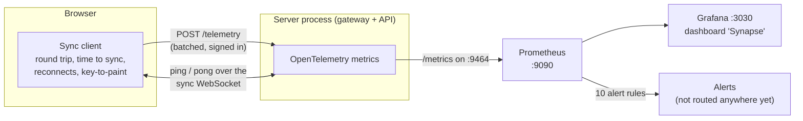

# Observability

One Grafana dashboard shows how Synapse feels to the people using it (sync latency,
typing latency, reconnects), how the servers are coping (sockets, messages, database
writes, relay, API) and when something is wrong (alert rules).



## Run it

```bash
brew install prometheus grafana        # once
cd server && npm run dev               # the server exposes http://127.0.0.1:9464/metrics
observability/start.sh                 # Prometheus :9090 and Grafana :3030
```

Open <http://localhost:3030/d/synapse-overview/synapse>. The dashboard is shown
without logging in (read-only, bound to 127.0.0.1); the admin login is `admin` /
`admin`. `observability/stop.sh` stops both. Data lives in `.infra/`, nothing starts at
login. To put some load on it, with an account you created locally:
`cd server && DEMO_EMAIL=you@example.com DEMO_PASSWORD=... npx tsx bench/demo-traffic.ts`.

Set `METRICS_PORT=0` to turn the metrics endpoint off, and `NEXT_PUBLIC_TELEMETRY=off`
to stop browsers from reporting.

## What is measured

**From the browsers** (the people's point of view). Each browser sends a small batch
every 15 seconds and when the page is left.

| Metric | Meaning |
|---|---|
| Round trip | The sync client asks the gateway to echo a timestamp every 5 s. Covers browser, network and gateway. |
| Time to sync | From opening a connection to a fully synced document. |
| Reconnects, offline time | Coming back after a lost connection, and how long it took. |
| Connection outcomes | `attempt`, `synced`, `failed` (dropped by itself before syncing). |
| Keystroke to paint | Key press until the screen updates (printable keys, at most about 10 samples a second). |

**From the server** (gateway and API): open sockets and documents, joins by result,
messages by kind, edits refused (by role), malformed messages, access revocations, time
to process a message, edit sizes, **database write time and failures**, rooms holding
unsaved edits, compactions, **Redis relay traffic, up/down state, reconnects and
self-repair resyncs**, API request time by route and status class, failed sign-ins, rate
limiting, and process CPU, memory and event-loop delay.

### Label policy (privacy and cost)

Labels are fixed small words: `result`, `kind`, `role`, `reason`, `outcome`, `route`
(the route **pattern** such as `/documents/:id`, never the real URL), `status_class`.
**No user ids, document ids, names or text ever appear in a metric.** A test scans every
label of every metric for anything shaped like an id. Browsers are untrusted, so the
server accepts only a fixed list of names, fixed label values and sane numbers, and counts
everything else as "refused" (tested).

Chat adds one counter, `synapse_chat_messages{result}`, where the result is `sent` or the reason a message
was refused (`forbidden`, `invalid`, `rate`, `unavailable`). It is **not on the dashboard yet**, and `unavailable`
(chat could not be saved) has no alert. Chat is also counted in `synapse_gateway_messages{kind="chat"}`.

## The dashboard

31 panels in 7 rows, each with a plain-language description of what it means and what bad
looks like (hover the small "i"):

1. **Health at a glance:** open sockets, open documents, relay up/down, rooms with unsaved edits, connection success, API error share.
2. **Sync latency as people feel it:** round trip (red line at the 250 ms target), key-to-paint (red line at 50 ms), time to sync, offline time.
3. **Connections:** sockets and documents, joins, browser connection outcomes, reconnects, revocations and refused writes.
4. **Gateway work:** messages by kind, message processing time, edit sizes, database write time, write failures and compactions, unsaved rooms.
5. **Relay (Redis):** traffic, errors, reconnects and resyncs.
6. **API:** requests and slowest routes, status classes, failed sign-ins and rate limiting.
7. **Server process:** CPU, memory, event-loop delay.

The dashboard is generated by `observability/build-dashboard.py` and loaded through
provisioning with UI edits switched off, so what is in git is what runs.

## Service levels and alerts

- **Availability proxy ("connection success"):** `synced / (synced + failed)` over 5
  minutes. The target is 99.9%. Attempts the browser cancels itself (leaving the page,
  React's development double-mount) are deliberately **not** counted as failures.
- **Alert rules** (`observability/alerts.yml`, 10 basic alerts, checked with `promtool`): server
  down, round trip p95 above 250 ms, key-to-paint p95 above 50 ms, connection success
  below 99%, relay down, rooms with unsaved edits for 2 minutes, database write failures,
  event-loop delay above 100 ms, API 5xx above 1%, and a spike of malformed messages.
  **Nothing is wired to notify anyone**: there is no Alertmanager. They are the definition
  of "something is wrong", visible at <http://localhost:9090/alerts>.
- **The 99.9% SLO as error-budget burn rate** (added 6 October 2026, same file, 2 more alerts and 4
  recording rules, 16 rules in all). 99.9% leaves a budget of 0.1% failed connections, about 43 minutes
  a month. `AvailabilityBudgetFastBurn` pages when the budget is being spent 14.4 times too fast over
  1 hour *and* over the last 5 minutes (2% of a month's budget in an hour); `AvailabilityBudgetSlowBurn`
  warns at 6 times over 6 hours and 30 minutes. Both need a minimum amount of traffic, so a quiet
  period cannot trip them. This is the multiwindow method from the Google SRE Workbook.
  `promtool test rules observability/tests/slo_test.yml` feeds synthetic traffic and checks four
  cases: healthy traffic never alerts, a real outage pages, a short blip that has already recovered
  does not page, and almost no traffic never alerts. I broke the threshold on purpose and the outage
  test failed, so it can fail. CI runs it.
- **The outside view: an uptime probe** (`server/ops/uptime.ts`, 6 tests). It checks the API
  `/health`, the gateway `/health`, and, with a canary account and document, performs a **real Yjs sync**
  over the WebSocket. That third check matters: in a test, a gateway that answered `/health` but
  refused the canary's token was reported as failing only by the sync check. Run against the live local
  system it completed a sync in 108 ms. `.github/workflows/uptime.yml` runs it every 5 minutes and does
  nothing until you set `SYNAPSE_API_URL` and `SYNAPSE_GATEWAY_URL`.

## How it was verified

| Check | Result |
|---|---|
| Prometheus config and the 10 alert rules | pass `promtool` |
| All 50 panel queries | valid (0 errors); 27 of 31 panels had data after the demos, and the 4 empty ones were "bad thing" counters that correctly had nothing to show, now displayed as 0 |
| Tests | 4 server tests with a real in-memory metrics reader (joins, sockets, refused writes, ping echo, malformed messages, unsaved-room gauge, route labels, no ids in labels, browser-metric allowlist); 14 browser tests (which events the sync client reports and when, including the hidden-tab rule, and the beacon) |
| A test that can fail | Removing the hidden-tab guard makes its test fail ("expected length 0 but got 4"); restored |
| **Real Redis outage** (killed 25 s) | Relay tile went DOWN from 03:19:53 to 03:20:13, then 1 reconnect and 2 rooms resynced from the database; 21 Redis errors counted |
| **Real MongoDB outage** (killed 25 s) | "Rooms with unsaved edits" rose to 1 from 03:20:48 to 03:21:03, then back to 0; 1 write failure; 5 API 5xx responses |
| Network simulator, 1 s delay each way | Round trip p95 rose to about 2.3 s |
| Each bad event triggered once | 4 failed logins, 2 refused browser events (1 accepted), 1 malformed message (socket closed) |
| **Cost of instrumentation** | See below |

### Cost of instrumentation

Same benchmark, metrics off versus on, one machine, **single runs** (so only large
differences mean anything):

| Test | Metrics off | Metrics on |
|---|---|---|
| Propagation p95, one gateway (1,500 edits) | 2.01 ms | 1.89 ms |
| Propagation p95, two gateways via Redis | 3.11 ms | 3.11 ms |
| 100 editors: delay p95 | 5.85 ms | 5.26 ms |
| 100 editors: gateway CPU mean / peak | 17% / 25.5% | 18% / 28.7% |
| 100 editors: gateway memory peak | 180 MB | 192 MB |

Roughly 1 to 3 points of CPU and 12 MB of memory, with latency unchanged within noise. The
absolute latencies are higher than in `BENCHMARKS.md` because Prometheus, Grafana and the
dev servers were running during these runs.

## Problems found while building it

- OpenTelemetry's metrics API **cannot bind instruments created before the SDK exists**,
  so every metric silently recorded nothing. A test caught it; the instruments are now
  rebuilt when telemetry starts.
- The round-trip histogram stopped at 1 s, so slow connections were **clamped to 1 s**,
  hiding exactly the case that matters. Buckets now reach 30 s.
- Backgrounded tabs have their timers throttled by the browser, producing **fake 30-second
  round trips**. Measurements now stop while the tab is hidden (tested).
- Counting cancelled connections as failures made the availability measure wrong (it read
  50% in development). Only connections that drop by themselves count.
- A "rooms with unsaved edits" gauge could have stuck at 1 forever if a room closed while the
  database was down. It is now cleaned up and the loss is logged loudly.
- Stat tiles showed red "no data" before any traffic, which looks like an outage. "No data"
  is now a neutral state, and counters that are normally 0 display 0.

## What it cannot see (known limits)

- **The availability proxy is blind exactly when it matters most.** It is reported by
  browsers *through the API*. If the whole server is down, no browser can report that it
  failed, so the tile goes quiet instead of red. The `SynapseDown` alert (Prometheus
  cannot scrape the server) covers that, and the **uptime probe** above is the outside view.
  **But nothing is deployed, so the probe has only ever run against a laptop and there is no
  real availability number yet.**
- Only people whose browsers report are counted (not people with telemetry off, ad
  blockers, or who fail before the app loads).
- **No traces.** The brief names OpenTelemetry; only its metrics are used (a request trace
  across browser, API and gateway was not built). **Logs are structured now** (Pino, one JSON
  object per line, with the route pattern but never the real URL, and `authorization`, `password`
  and `token` redacted), but they are not shipped anywhere: no Loki or log search.
- **The browser does not run the OpenTelemetry SDK.** A small authenticated beacon sends
  timings to the server, which turns them into OpenTelemetry metrics. This keeps the
  browser bundle small and the accepted data strictly controlled.
- **One Prometheus, one scrape target, 7 days of retention**, no high availability. The
  `/metrics` endpoint is unauthenticated and bound to `127.0.0.1`; in production it must sit
  behind a network boundary.
- Grafana runs with anonymous read-only viewing and the default `admin` password, for local
  use only.
- With several gateways, each exposes its own `/metrics` (they would need their own ports,
  and `prometheus.yml` listing them); this was not run with more than one process.
- **Visual check was partial.** I looked at the dashboard in a browser for the health,
  sync-latency, connections and gateway-work rows. The relay, API and process rows were
  checked through their queries (valid, with data), not by eye. The browser pane was small,
  so layout at normal desktop size was not fully reviewed.
- Panels are only as good as the thresholds: the 250 ms and 50 ms lines come from the
  project's targets, not from measured production behaviour.
